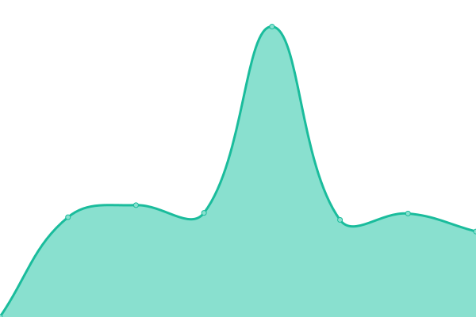

# Status for indoor=

Status page for indoorequal.org website and API.

<!--start: status pages-->
<!-- This summary is generated by Upptime (https://github.com/upptime/upptime) -->
<!-- Do not edit this manually, your changes will be overwritten -->
<!-- prettier-ignore -->
| URL | Status | History | Response Time | Uptime |
| --- | ------ | ------- | ------------- | ------ |
|  [indoorequal.org](https://indoorequal.org) | 🟩 Up | [indoorequal-org.yml](https://github.com/indoorequal/status/commits/HEAD/history/indoorequal-org.yml) | 

 581ms
     
 | 

<a href="https://status.indoorequal.org/history/indoorequal-org">100.00%</a>
    

|  tiles.indoorequal.org | 🟩 Up | [tiles-indoorequal-org.yml](https://github.com/indoorequal/status/commits/HEAD/history/tiles-indoorequal-org.yml) | 

 685ms
     
 | 

<a href="https://status.indoorequal.org/history/tiles-indoorequal-org">100.00%</a>
    

|  [Replication lag](https://tiles.indoorequal.org/replicationstatus) | 🟨 Degraded | [replication-lag.yml](https://github.com/indoorequal/status/commits/HEAD/history/replication-lag.yml) | 

 171ms
     
 | 

<a href="https://status.indoorequal.org/history/replication-lag">99.54%</a>
    

|  [taginfo.indoorequal.org](https://taginfo.indoorequal.org/) | 🟩 Up | [taginfo-indoorequal-org.yml](https://github.com/indoorequal/status/commits/HEAD/history/taginfo-indoorequal-org.yml) | 

 708ms
     
 | 

<a href="https://status.indoorequal.org/history/taginfo-indoorequal-org">100.00%</a>
    

<!--end: status pages-->
